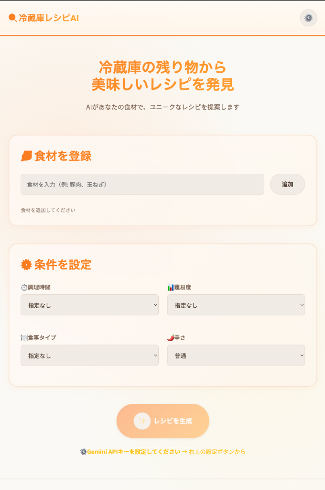
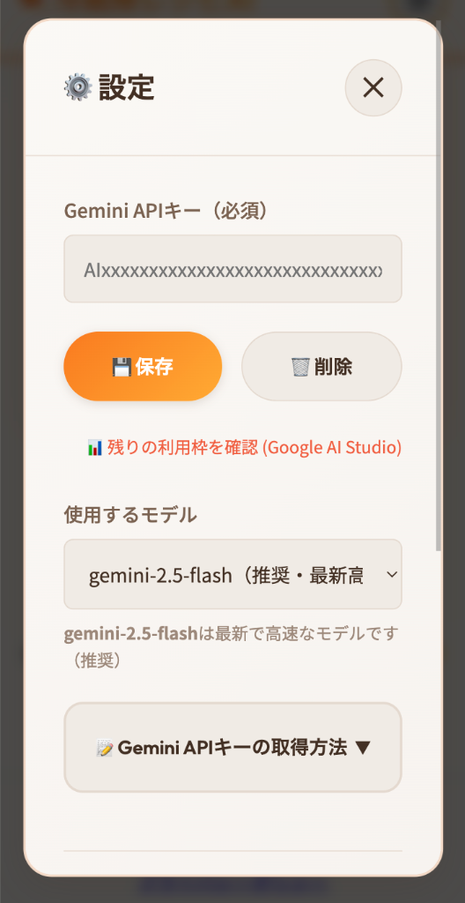

## 💡 はじめに：献立の悩みと食品ロスを同時に解決したい


毎日の料理で解決したい「何を作ろう？」という悩みと、「もったいない」という食品ロスの課題。
Gemini AIを活用して、これらを一気に解決するアプリを開発しました。


毎日の料理でこんな経験ありませんか？

- 冷蔵庫の食材が余ってしまいレシピが思いつかない
- 忙しくて短時間で作れる料理を探したい
- せっかく買った食材を捨ててしまい罪悪感がある

食品ロスは日本だけでも年間約523万トン。家庭から出る割合はそのうち約47%と言われています。
この課題を“楽しく美味しく”解決するために開発したのが 「Leftover Recipe AI」 です。

## 🍳 Leftover Recipe AI とは？3つの特徴


Leftover Recipe AI は **冷蔵庫の余り食材を入力するだけで、Google Gemini AI が最適なレシピを生成してくれるWebアプリ** です。


### ① 食材 × 条件からレシピをAI生成

- 難易度（簡単 / 普通 / 上級）
- 調理時間
- 食事タイプ（朝食 / 昼食 / 夜食 / おやつ）
- 辛さ（辛くない / 普通 / 辛い / とても辛い）

これらをプロンプトに組み込み、**定番レシピから創造的なアイデア料理まで幅広く提案** します。

### ② 料理画像も自動表示（Unsplash API連携）

生成されたレシピ名から画像検索し、視覚で料理の完成イメージも確認 できます。文字だけのレシピサイトと違い、献立選びが直感的に楽しくなります。

### ③ データはブラウザ内で管理

APIキーやお気に入りレシピは LocalStorage に保存 されるため、ログイン不要＆サーバー保存なしで安心。

## 🚀 使い方（1分で完了）

1. 設定アイコンから Gemini APIキー（無料） を入力

2. 余っている食材を入力（例：キャベツ / 卵 / 豚肉）
3. 「✨ レシピを生成」ボタンをクリック！

## 🛠 技術スタック（個人開発で“完全無料”を実現）


インフラ、AI、画像APIをすべて「無料枠」で組み合わせることで、**運用コスト0円** を実現しています。


| 項目 | 技術 | 採用理由 |
| :--- | :--- | :--- |
| フロントエンド | Vite + Vanilla JavaScript（ES6+） | フレームワークを使わず軽量・爆速動作を優先 |
| AI | Google Gemini API（@google/genai SDK） | Gemini 2.5 Flash を採用し応答速度を最適化 |
| 画像 | Unsplash API | 高品質で商用利用OKな画像を無料提供 |
| データ管理 | LocalStorage | サーバー不要・ログイン不要・安全 |

※インフラ、DB、AI、画像APIすべて **完全無料で運用可能** です。

## 🎨 UI/UX のこだわり

- 料理サイトらしい“温かみのある色設計”
- スマホでも使いやすいレスポンシブ対応
- APIレート制限・エラー時の親切なハンドリング

ユーザーが迷わないように **わかりやすい導線とエラーメッセージ設計** を徹底しました。

## 👨‍💻 開発背景：自分が一番使いたかった

このアプリは「個人開発で収益化したい」よりも **自分の生活の課題をまず解決したい** からスタートしました。
結果として今では僕自身が毎日使っています。

- 冷蔵庫の掃除ができる
- 献立がすぐ決まる
- しかも美味しい

まさに **一石三鳥のWebアプリ** になりました。

## 🥗 こんな人におすすめ

- 料理レシピを考えるのが苦手な人
- 15分以内で作れる献立を探したい人
- 食品ロスを減らしたい人
- 料理サイト運営者・プロンプト設計に興味ある人（技術的な学びにも）

## 🔗 アプリはこちらからどうぞ


アプリを開く (ai-recipe.yu-fu.site)


※Gemini APIキーがあればすぐ使えます（完全無料）

## さいごに

「冷蔵庫の余り物 レシピ AI」「食品ロス 家庭 解決」「時短 レシピ提案」などの検索ニーズを満たしつつ、実用性とワクワク感を両立させたアプリです。

ぜひ使ってみてください！
感想やフィードバックも大歓迎です。
