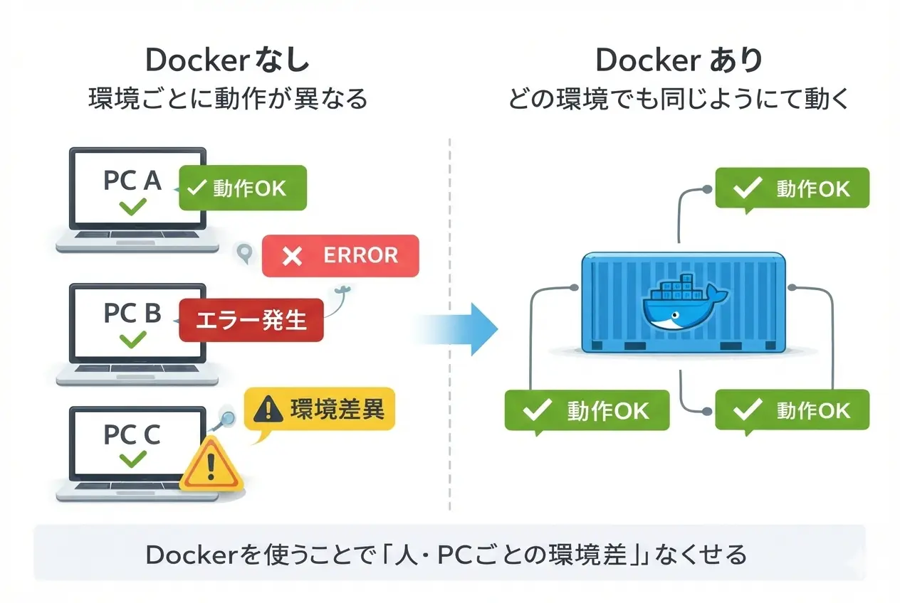
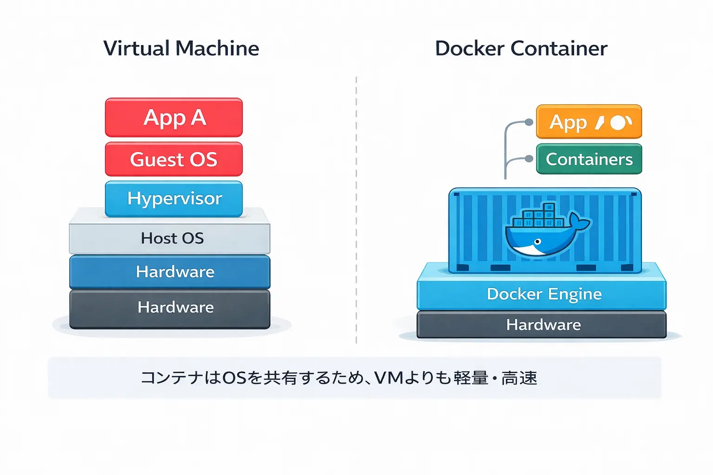
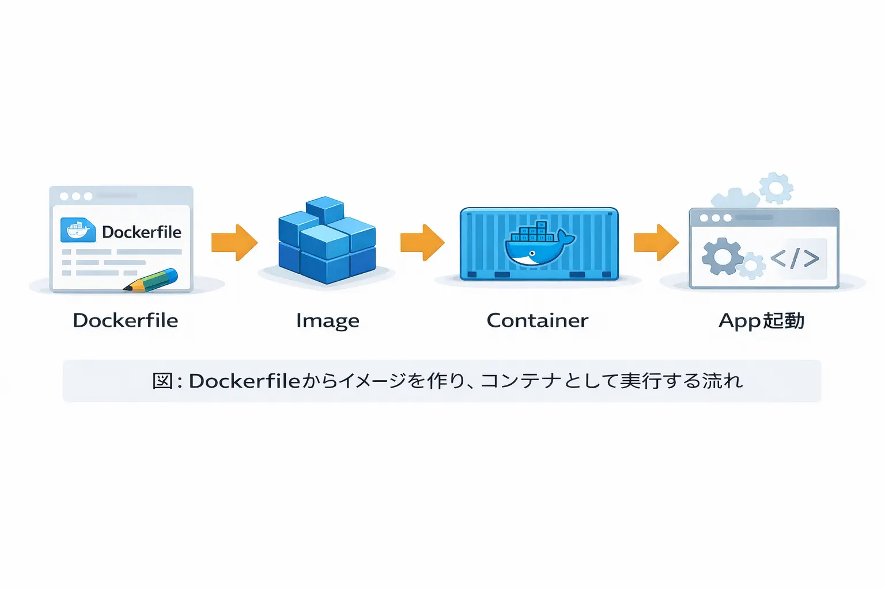
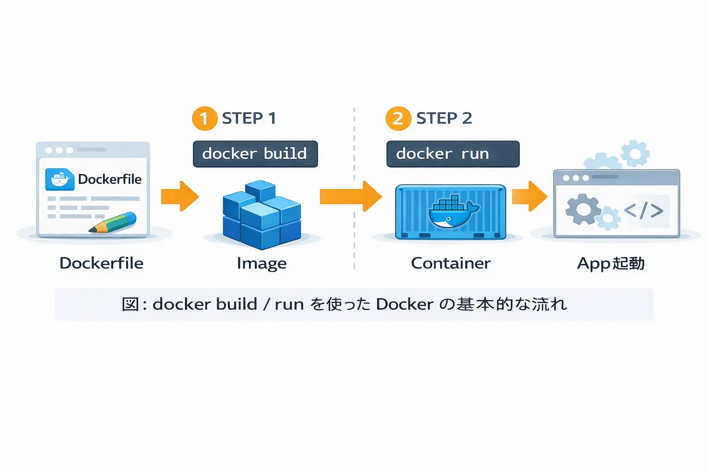


Web開発やシステム運用において、「環境構築」は避けて通れない課題です。
しかし実際には、**先輩のPCでは動くのに、自分の環境ではエラーが出る**といった経験をしたことがある方も多いのではないでしょうか。


<figure class="moov-structure">
  

  <figcaption>
    <strong>図：Dockerなし vs Dockerありの開発環境比較</strong>
  </figcaption>
</figure>

このような **「環境依存によるトラブル」** は、開発効率を大きく下げてしまいます。

そこで登場するのが **Docker** です。
Dockerを使えば、アプリケーションとその実行環境をまとめて管理でき、**どこでも同じように動く環境**を簡単に再現できます。

本記事では、Dockerの基本的な仕組みから重要な用語、さらに実務で役立つ基本コマンドまでを、初心者にも分かりやすく解説します。

---

## 1. Dockerとは何か？コンテナ技術の基礎知識

Dockerとは、**コンテナ型仮想化技術**を利用して、アプリケーションとその実行環境をまとめてパッケージ化・実行するためのプラットフォームです。

従来のように環境ごとに手作業でセットアップする必要はなく、Dockerを使えば「定義された通りの環境」を一瞬で用意できます。

### 1.1 コンテナと仮想マシン（VM）の違い

<figure class="moov-structure">
  

  <figcaption>
    <strong>図：VM と Dockerコンテナの構造比較</strong>
  </figcaption>
</figure>

環境を隔離する技術としてこれまで主流だった「仮想マシン（VM）」と、Dockerの「コンテナ」は仕組みが大きく異なります。

| 項目 | コンテナ（Docker） | 仮想マシン（VM） |
| :--- | :--- | :--- |
| **OS** | ホストOSのカーネルを共有 | ゲストOSを個別に含む |
| **起動速度** | **非常に高速（数秒）** | 比較的遅い（数分） |
| **リソース** | 軽量（省電力・省メモリ） | 重厚（リソース消費大） |

> [!NOTE]
> コンテナは **ゲストOSを持たない** ため、軽量かつ高速に起動できるのが最大の特徴です。結果として、開発用途やCI/CDとの相性も抜群です。

### 1.2 Dockerの主要な構成要素（必須3用語）

<figure class="moov-structure">
  

  <figcaption>
    <strong>図：Dockerfile → Image → Container → App起動 の基本フロー</strong>
  </figcaption>
</figure>

Dockerを理解するうえで、まずは次の3つの用語を押さえておきましょう。

1.  **イメージ（Image）**
    - コンテナを作成するための**設計図**です。実行に必要なアプリや設定がすべて含まれています。
2.  **コンテナ（Container）**
    - イメージを元に実際に起動された **実行環境そのもの** です。使い捨て感覚で扱えるのが特徴です。
3.  **Dockerfile**
    - イメージを作成するための**手順書**です。どのOSを使い、何をインストールするかをテキストで記述します。

---

## 2. Dockerの基本的な使い方とコマンド

<figure class="moov-structure">
  

  <figcaption>
    <strong>図：Image → Container → Running App の基本フロー</strong>
  </figcaption>
</figure>

Dockerの基本的なワークフローは、**手順を書く → 設計図を作る → 実行する**の3ステップです。

### 2.1 イメージの作成（docker build）

Dockerfileがあるディレクトリで、次のコマンドを実行して「イメージ」を作成します。

```bash
docker build -t [イメージ名]:[タグ名] .
```
- `-t`：イメージに名前とバージョン（タグ）を付けます。
- `.`：Dockerfileの場所（現在のディレクトリ）を指定します。

### 2.2 コンテナの起動（docker run）

作成したイメージからコンテナを起動します。

```bash
docker run -d -p [ホストポート]:[コンテナポート] [イメージ名]
```
- `-d`：バックグラウンドで起動します。
- `-p`：自分のPCのポートとコンテナのポートを繋ぎます（例：`8080:80`）。

---

## 3. よく使う基本操作コマンド一覧

これらを覚えておくだけで、日々のDocker操作はかなりスムーズになります。

| コマンド | 内容 |
| :--- | :--- |
| `docker ps` | 実行中のコンテナ一覧を表示 |
| `docker stop [ID]` | コンテナを停止 |
| `docker rm [ID]` | 停止したコンテナを削除 |
| `docker images` | ローカルにあるイメージ一覧を表示 |
| `docker rmi [ID]` | イメージを削除 |

---

## 4. まとめ：Dockerがもたらす恩恵

Dockerを導入することで、開発チームには以下のメリットがもたらされます。

- ✅ **環境の完全な統一**: 開発・テスト・本番環境を確実に合わせられます。
- ✅ **高い再現性**: Dockerfileさえあれば、誰でも同じ環境を即座に作れます。
- ✅ **デプロイの高速化**: 作成したイメージをそのまま本番へ持っていくだけでOK。

まずは、自分の簡単なプロジェクトをDocker化してみることから始めてみてください。一度その便利さを体験すると、以前の環境構築には戻れなくなるはずです！🚀

---

### 📘 関連ボタン

Docker 公式ドキュメント

