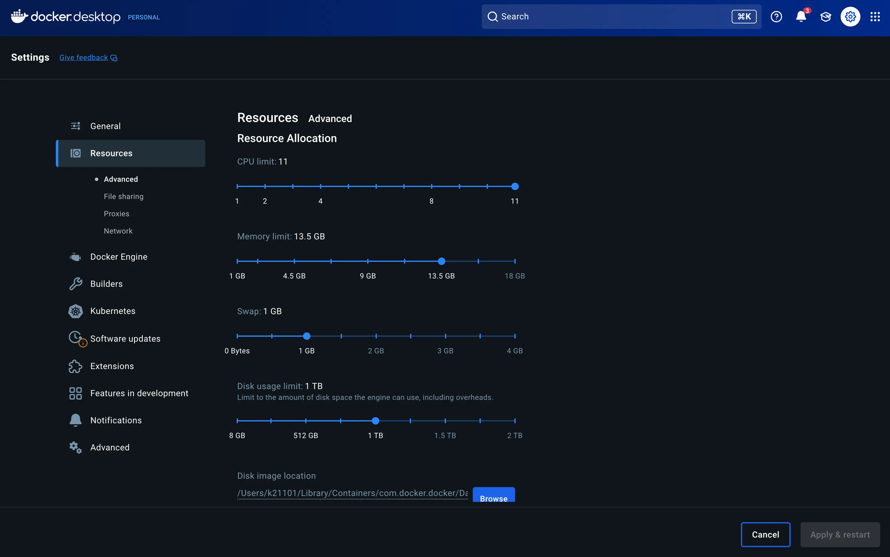


Dockerを使用していると、

- コンテナが落ちる
- ビルドが失敗する
- 動作が異常に遅い

といった問題に遭遇することがあります。

その原因の多くは **メモリ不足** です。

この記事では、**Dockerのメモリを増やす方法**を  
Mac・Windows・Linux別にわかりやすく解説します。


---

## なぜDockerでメモリ不足が起きるのか

DockerはホストOSとは別にリソース制限がかかる場合があります。

特に以下のケースで発生します。

- Docker Desktopのデフォルト制限
- コンテナごとのメモリ制限
- 複数コンテナの同時起動

👉 つまり  
**PCに余裕があってもDocker側で制限されていることがある**のがポイントです。

---

## 現在のメモリ使用状況を確認する

まずは状況を確認しましょう。

```bash
docker stats
```

表示例

```
CONTAINER ID   NAME   CPU %   MEM USAGE / LIMIT
abc123         app    20%     500MiB / 1GiB
```

👉 `LIMIT` が上限メモリです

---

## Docker Desktop（Mac / Windows）でメモリを増やす方法

Docker Desktopを使っている場合は、GUIから設定できます。

<figure class="moov-structure">
  

  <figcaption>
    <strong>図：Docker Desktopでメモリを変更する設定画面</strong>
  </figcaption>
</figure>

### 手順

1. Docker Desktopを開く
2. Settings（設定）を開く
3. Resources → Memory
4. メモリを増やす（例：2GB → 4GB）
5. Apply & Restart

👉 これでDocker全体のメモリ上限が増えます

---

## docker runでメモリを増やす

コンテナ単位で制限することも可能です。

```bash
docker run -m 2g nginx
```

### オプション

* `-m`：最大メモリ
* `--memory-swap`：スワップ含む上限

例

```bash
docker run -m 2g --memory-swap 3g nginx
```

---

## docker-composeでメモリを増やす

```yaml
services:
  app:
    image: node
    deploy:
      resources:
        limits:
          memory: 2g
```

👉 注意

* `deploy` はSwarm用
* 通常のcomposeでは効かない場合あり

---

## docker-compose（通常環境）での正しい設定

```yaml
services:
  app:
    image: node
    mem_limit: 2g
```

👉 こちらの方が実務ではよく使われます

---

## Linux環境でメモリを増やす

LinuxではDocker自体に制限はないことが多いですが、

### cgroup制限がある場合

```bash
cat /sys/fs/cgroup/memory.max
```

---

### systemdで制限されている場合

```bash
sudo systemctl set-property docker.service MemoryMax=4G
```

---

## よくある原因と対処法

### コンテナがOOMKilledになる

```
OOMKilled
```

原因

👉 メモリ不足

対策

* メモリを増やす
* 不要コンテナを停止
* `docker system prune` を実行

---

### ビルドが途中で止まる

原因

* node_modules
* 大量依存

対策

```bash
docker build --memory=4g .
```

---

## メモリ最適化のポイント

### 不要コンテナを削除

```bash
docker container prune
```

---

### イメージ削除

```bash
docker image prune
```

---

### system全体整理

```bash
docker system prune
```

---

## 注意点

### メモリを増やしすぎない

👉 PC全体が重くなる

---

### swapに頼りすぎない

👉 パフォーマンス低下

---

## FAQ

### メモリはどれくらい必要？

目安：

* 軽量アプリ：1〜2GB
* Webアプリ：2〜4GB
* DB込み：4GB以上

---

### なぜPCは余裕あるのに落ちる？

👉 Docker側の制限が原因

---

## まとめ

Dockerのメモリ不足はよくある問題ですが、

* Docker Desktopで設定変更
* コンテナごとに制限調整
* 不要リソース削除

を行うことで解決できます。

👉 **まずは「どこで制限されているか」を確認するのが重要です。**
