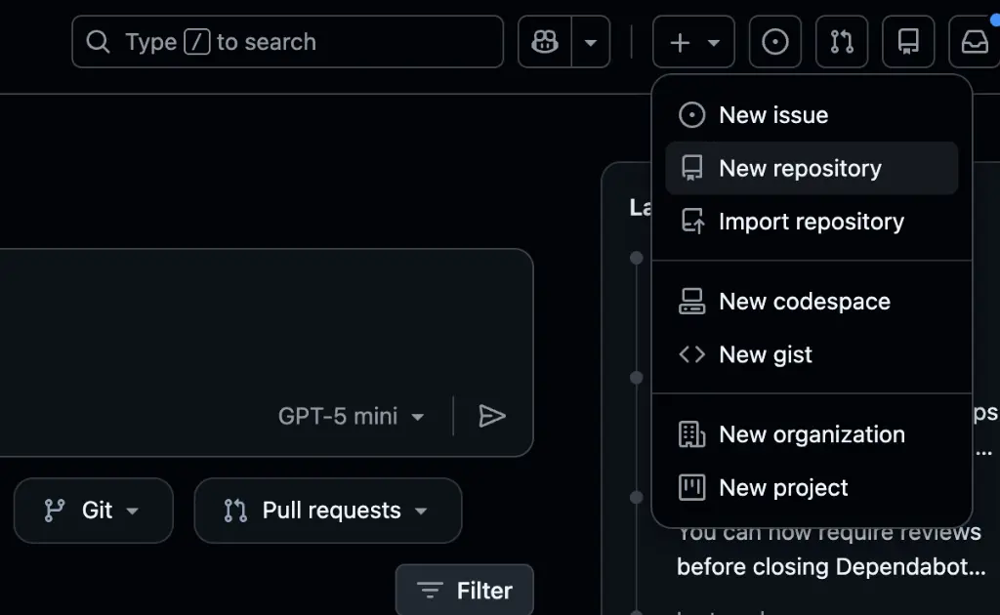
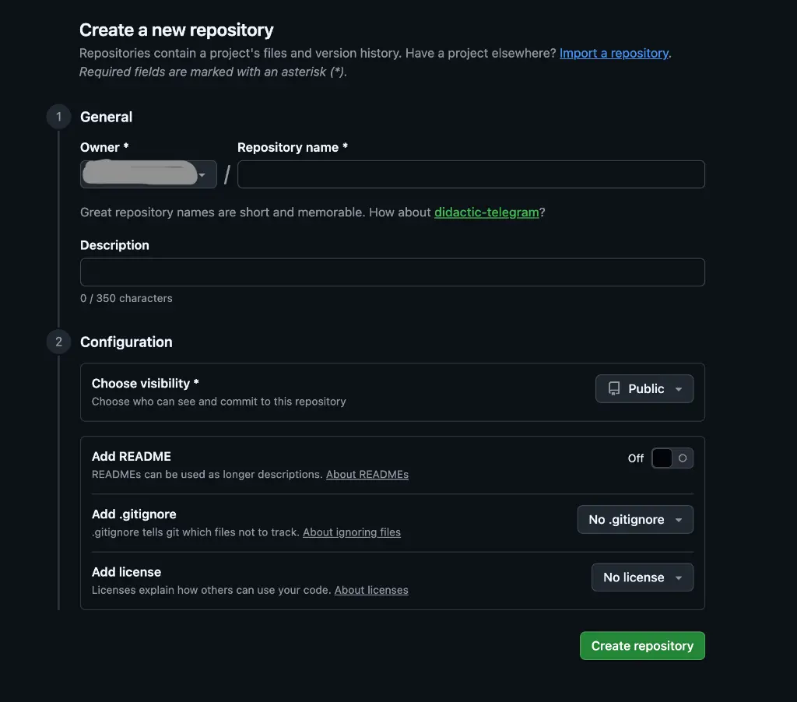


私はこれまで、個人開発からチーム開発まで、さまざまな現場でGitとGitHubを使ってきました。
その中で強く感じるのは、**Gitを正しく理解していないことが、開発効率や事故の大きな原因になる**という事実です。


実際に、
- 直接 `main` ブランチに push してしまう
- コンフリクトを恐れて Git を使わなくなる
- なぜ Pull Request が必要なのか分からない

といった問題は、Git/GitHubの仕組みを「表面的に」覚えただけの状態で起こります。

この記事では、
1. **Git と GitHub の役割の違い**
2. **実務で最低限必要な Git コマンド**
3. **チーム開発で標準となる GitHub フロー**

を、現場視点・失敗しがちなポイント込みで解説します。

---

## 1. GitとGitHubの違いを正しく理解する

GitとGitHubはセットで語られがちですが、役割は明確に異なります。


この違いを理解しないまま使い始めると、必ずどこかで混乱します。


### Gitとは何か？（ローカルで動くバージョン管理システム）
Gitは、あなたのPC（ローカル環境）で動作するツールです。

- **役割**: ファイルの変更履歴を記録する
- **追跡**: 「いつ・誰が・何を」変更したかを追跡する
- **安全**: 過去の状態に安全に戻れるようにする

> [!IMPORTANT]
> Gitは単なる「バックアップツール」ではありません。
> **変更の履歴を積み重ねる仕組み**だと理解すると、操作の意味が分かりやすくなります。

### GitHubとは何か？（Gitを共有するためのプラットフォーム）
GitHubは、Gitで管理されたリポジトリをインターネット上で共有・管理するためのWebサービスです。

- **コードの中央管理**: チーム全員が同じ最新コードを見る
- **Pull Request**: コードレビューによる品質担保
- **Issue**: タスク管理や議論の場


- **Git** = ツール（ローカルで使う道具）
- **GitHub** = 場所（共有・交流するためのプラットフォーム）


---

## 2. GitHubを使った開発の基本構造

GitHub開発の基本単位は「リポジトリ」です。

### リポジトリとは
リポジトリは、ソースコード、設定ファイル、ドキュメントなど、プロジェクトに必要なものをすべて管理する保管庫です。

**新規リポジトリ作成手順：**



1. GitHubにログイン
2. 右上の「+」→「New repository」



3. Repository name を入力
4. Public / Private を選択
5. 「Create repository」をクリック

---

## 3. ローカルで使う必須Gitコマンド

### `git clone`：リポジトリを取得する
```bash
git clone https://github.com/yourname/your-repo.git
```
GitHub上のリポジトリを、ローカル環境にコピーします。

### `git status`：現在の状態を確認する
```bash
git status
```
変更されたファイル、ステージング状態を確認するための **最重要コマンド** です。

### `git add` / `git commit`：変更を記録する
```bash
git add .
git commit -m "feat: ログイン機能を追加"
```
- **add**: 変更を「記録対象」にする
- **commit**: 変更を履歴として確定する

---

## 4. チーム開発で必須のブランチ運用

### なぜブランチを切るのか
直接 `main` ブランチで作業すると、**不完全なコードが混入したり、他人の作業を妨げたりするリスク**があります。

### ブランチは「作業専用の部屋」
```bash
git checkout -b feature/login
```
このブランチ上で、本番コードに影響を与えず安心して作業を行います。

### Pull Request（PR）の役割
Pull Requestは、**この変更を main に取り込んで良いか**をチームに確認するための仕組みです。


**PRで行われること：**
- コードレビューによる品質チェック
- 設計や考慮漏れの発見
- ナレッジの共有


---

## 5. まとめ：GitHubは「チーム開発の基盤」

GitとGitHubは、個人開発、チーム開発、OSS参加すべてにおいて必須のスキルです。まずは、`add` / `commit` / `push` という基本的な流れを、手を動かして身につけてください。

---

### 📘 筆者について
本記事は、Webアプリケーションのチーム開発、GitHubを用いたレビュー運用、Git操作ミスによる事故対応を実務で経験してきたエンジニアが執筆しています。

### 関連資料
さらに深く学びたい方は、こちらの資料も参考にしてみてください。


Zennで学ぶ：Git実践ガイド

