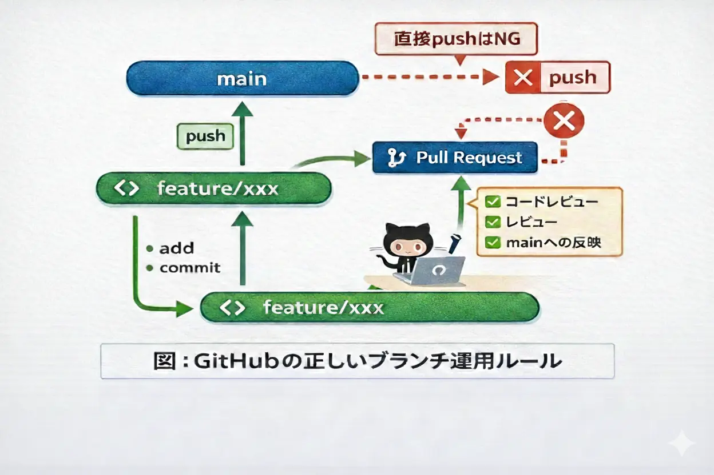


GitHubを使った開発において、  
**「mainブランチに直接pushしてはいけない」**  
というルールを一度は聞いたことがあるはずです。

しかし、

- なぜ禁止なのか
- 個人開発でも守るべきなのか
- 破ると何が起きるのか

を、きちんと理解しないまま運用しているケースも少なくありません。

この記事は、以下のような人に向けて書いています。

- チーム開発を始めたばかりの人
- 個人開発でもGitHub運用をきちんとしたい人
- 「なぜダメなのか」を理解したい人

この記事では、**GitHub運用の基本ルールとして  
mainブランチに直接pushしてはいけない理由**を、  
実務目線で分かりやすく解説します。


<figure class="moov-structure">
  

  <figcaption>
    <strong>図：GitHubの正しいブランチ運用（mainブランチへの直接pushは禁止）</strong>
  </figcaption>
</figure>

---

## mainブランチとは何か？

mainブランチは、  
**常に本番として公開可能な状態を保つブランチ**です。

多くのプロジェクトでは、

- 本番環境にデプロイされる
- CI/CDの起点になる
- 他のブランチの基準点になる

といった、**最も重要な役割**を担っています。

つまり mainブランチが壊れる＝  
**プロジェクト全体が壊れる** ということです。

---

## なぜ mainブランチへの直接pushが禁止されるのか

理由はシンプルで、  
**事故が起きやすく、検知しにくいから**です。

### 1. レビューを通らない

直接pushすると、

- コードレビューが行われない
- 設計ミスや仕様漏れに気づけない
- 属人化が進む

という状態になります。

Pull Request（PR）は、  
**コードを「人の目にさらす」ための安全装置**です。

---

### 2. CIが壊れた状態で混入する

mainブランチは多くの場合、

- テスト
- ビルド
- デプロイ

の起点になります。

直接pushすると、

- テスト未実行
- ビルド失敗
- 本番デプロイ失敗

といった状態が、そのまま混入します。

---

### 3. 巻き戻しが難しい

mainブランチに直接pushされた変更は、

- 誰が
- 何の意図で
- どこを壊したのか

が分かりにくくなります。

結果として、

- revertが怖い
- 修正PRが増殖する
- 履歴が汚れる

という負の連鎖が起きます。

---

## 正しいブランチ運用ルール（基本形）

最も基本で安全なルールは、以下です。

```
feature/xxx
   ↓ Pull Request（レビュー必須）
main
```

### ルールの原則

- **mainブランチに直接pushしない**
- 作業は必ず feature ブランチで行う
- main への反映は Pull Request 経由のみ

このルールだけで、  
トラブルの大半は防げます。

---

## 個人開発でも守るべき？

結論：**YES** です。

理由は、

- 将来チーム開発に移行しやすい
- PRベースの思考が身につく
- 変更履歴が読みやすくなる

からです。

特に、

- OSS公開
- 技術ブログ用リポジトリ
- 長期運用プロジェクト

では、**個人でもmain直pushは避けるべき**です。

逆に言うと、個人開発でmain直pushに慣れてしまうと、
チーム開発に入ったときに高確率で事故を起こします。

---

## GitHubで物理的に禁止する方法

ルールは決めるだけでは意味がありません。  
人は必ずミスをするからです。

そこで重要なのが、**GitHubの設定で「物理的に禁止する」こと**です。

GitHubの設定を使えば、  
**mainブランチへの直接pushを設定で禁止**できます。

これは「Branch protection rules」という機能で実現できます。

### Branch protection rules

- mainブランチを保護対象に設定
- Pull Request必須
- CI成功必須
- 強制push禁止

これにより、

> 「うっかりpushしてしまった」

という事故自体を防げます。

---

## mainブランチ直pushで実際に起きがちな事故

- 本番が即落ちる
- 壊れた状態でデプロイされる
- 金曜夜に障害が発生する
- 誰も原因を追えない

**ほぼ全て、現場で実際に起きた話**です。

---

## まとめ

mainブランチは、  
**触ってはいけない神聖な場所**です。

- mainに直接pushしない
- 必ずPull Requestを通す
- ルールは設定で強制する

この3点を守るだけで、  
GitHub運用の事故率は劇的に下がります。

ブランチ運用は、  
**スキルではなく文化**です。

---

## 📘 関連資料

GitHub公式：保護されたブランチ

