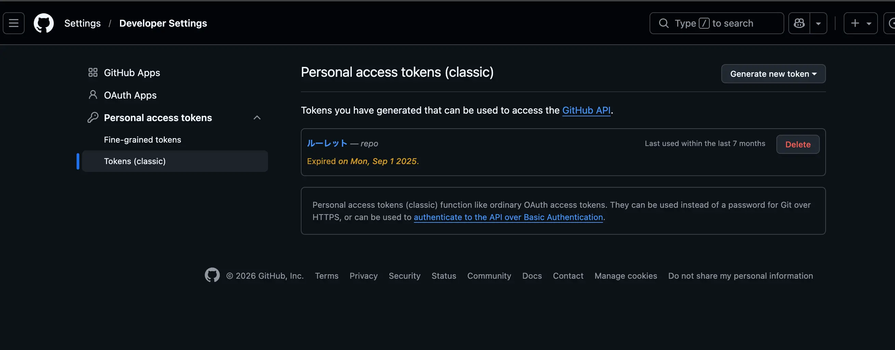
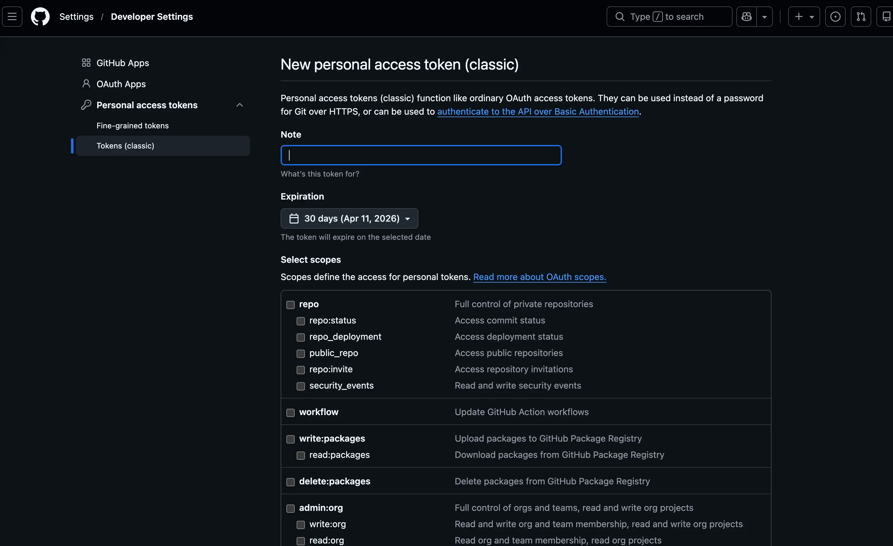


2021年以降、GitHubではパスワードによるGit操作が廃止され、  
代わりに **Personal Access Token（PAT）** を利用する必要があります。

この記事では、GitHubで**Personal Access Token（classic）の取得方法**を初心者向けにわかりやすく解説します。  
トークン作成手順から **git pushでの使用方法**まで順番に紹介します。


---

## GitHub Personal Access Token（classic）とは

Personal Access Token（PAT）は、GitHubのAPIやGit操作を行うための**認証トークン**です。

従来はGit操作時にパスワードを入力していましたが、現在はセキュリティ強化のため **トークン認証**が必要になっています。

主な用途は以下です。

- git clone
- git push
- GitHub APIの利用
- CI/CD認証

---

## GitHub Personal Access Token（classic）の取得方法

トークンはGitHubの設定画面から作成できます。

<figure class="moov-structure">
  

  <figcaption>
    <strong>図：GitHub SettingsからPersonal Access Tokenを作成する画面</strong>
  </figcaption>
</figure>

### 手順

1. GitHubにログイン  
2. 右上のプロフィールアイコンをクリック  
3. **Settings** を開く  
4. 左メニューの **Developer settings** をクリック  
5. **Personal access tokens** を選択  
6. **Tokens (classic)** をクリック  
7. **Generate new token (classic)** をクリック  

---

## GitHub Personal Access Token の設定

トークン作成時にはいくつか設定を行います。

### Note

トークンの用途を分かりやすく記入します。

例

```

git-access-token

```

---

### Expiration

トークンの有効期限を設定します。

おすすめ

```

90 days

```

セキュリティの観点から、**無期限は避けることを推奨します。**

---

### Scope（権限設定）

Git操作で使用する場合は以下をチェックします。

<figure class="moov-structure">
  

  <figcaption>
    <strong>図：Generate new token (classic) 画面</strong>
  </figcaption>
</figure>

```

repo

```

これで

- clone
- push
- pull

が可能になります。

---

## GitHub Personal Access Token を生成する

設定が完了したら

```

Generate token

```

をクリックします。

表示されたトークンは **一度しか表示されないため必ずコピーして保存してください。**

---

## Git cloneでPersonal Access Tokenを使用する方法

GitHubではHTTPSでリポジトリをcloneする場合、パスワードの代わりに **Personal Access Token（PAT）** を使用して認証します。

### 1. Git cloneを実行する

まず通常通り `git clone` コマンドを実行します。

```bash
git clone https://github.com/ユーザー名/リポジトリ名.git
```

例

```bash
git clone https://github.com/example/sample-repo.git
```

---

### 2. 認証情報を入力する

clone時に以下のような認証が求められます。

```
Username for 'https://github.com':
Password for 'https://github.com':
```

ここで入力する内容は以下です。

```
Username：GitHubのユーザー名
Password：Personal Access Token
```

※ **パスワードの代わりにPersonal Access Tokenを入力します。**

---

### 3. clone完了

認証が成功すると、リポジトリがローカルにダウンロードされます。

```
Cloning into 'sample-repo'...
remote: Enumerating objects...
Receiving objects: 100%
```

---

### Token入力を省略する方法（Credential保存）

毎回Tokenを入力するのが面倒な場合は、GitのCredential機能で保存できます。

```bash
git config --global credential.helper store
```

この設定を行うと、最初に入力したTokenが保存され、次回以降の認証が自動化されます。

---

### 注意点

Personal Access Tokenは **パスワードと同じ扱いの機密情報**です。

以下の点に注意してください。

* 公開リポジトリにTokenを記載しない
* ブログやSNSにTokenを貼らない
* 定期的にTokenを更新する

Tokenが漏洩した場合は、GitHubの設定画面から **すぐにRevoke（無効化）**することをおすすめします。

---

## Git操作でTokenを使用する方法

git push時にユーザー名とパスワードを求められた場合、以下を入力します。

```

username：GitHubユーザー名
password：Personal Access Token

```

パスワードの代わりに **Tokenを入力**します。

---

## Tokenが必要になるケース

以下の操作ではToken認証が必要になります。

- HTTPSでgit clone
- git push
- GitHub Actions
- GitHub API

---

## Personal Access Tokenの注意点

Personal Access Token（PAT）は、GitHubにアクセスするための**認証情報**です。
パスワードと同じ役割を持つため、取り扱いには十分注意する必要があります。

### Tokenは公開しない

Personal Access Tokenは**パスワードと同じ機密情報**です。

以下のような場所に公開しないよう注意してください。

* GitHubの公開リポジトリ
* ブログ記事やSNS
* コード内へのハードコード

Tokenが漏洩すると、第三者があなたのGitHubリポジトリへアクセスできてしまう可能性があります。

---

### 必要最小限の権限を設定する

Token作成時には **Scope（権限）** を設定できます。

必要以上の権限を付与すると、万が一Tokenが漏洩した場合のリスクが高くなります。

例えば、Git操作のみで使用する場合は以下の権限で十分です。

```
repo
```

用途に応じて **必要最小限の権限のみ設定する**ことをおすすめします。

---

### 有効期限を設定する

Token作成時には **Expiration（有効期限）** を設定できます。

セキュリティの観点から、以下のように**期限付きで運用する**ことが推奨されています。

例

```
30 days
90 days
```

長期間使用する場合でも、定期的にTokenを更新すると安全です。

---

### Tokenが漏洩した場合はすぐに無効化する

Tokenが漏洩した可能性がある場合は、すぐにGitHubの設定画面から **Revoke（無効化）** してください。

手順

1. GitHub Settings を開く
2. Developer settings
3. Personal access tokens
4. Tokens (classic)
5. 該当Tokenの **Delete / Revoke**

無効化すると、そのTokenはすぐに使用できなくなります。

---

## Tokenが使えない場合の原因

### 権限不足

scope設定が不足している可能性があります。

```

repo

```

が設定されているか確認してください。

---

### Token期限切れ

Expirationが過ぎると使用できなくなります。

新しいTokenを作成してください。

---

## Personal Access Token（fine-grained）との違い

現在GitHubでは

- Personal Access Token（classic）
- Personal Access Token（fine-grained）

の2種類があります。

fine-grained token はリポジトリ単位で
権限を細かく設定できます。

一方、classic token は
アカウント全体に対して
権限を付与する方式です。

|種類|特徴|
|---|---|
Personal Access Token (classic)|従来型トークン。多くのツールで利用可能|
Personal Access Token (fine-grained)|リポジトリ単位で権限を細かく設定できる|

既存のツールでは **classicが必要な場合もあります。**

---

## まとめ

GitHubでは現在、Git操作の認証に **Personal Access Token** を使用します。

取得手順は以下です。

1. GitHub Settingsを開く  
2. Developer settings  
3. Personal access tokens  
4. Tokens (classic)  
5. Generate new token  

作成したトークンは **パスワードの代わりに使用**します。

---

## よくある質問（FAQ）

### Personal Access Tokenは無料ですか？

はい。GitHubアカウントがあれば無料で作成できます。

### Personal Access Tokenはどこで確認できますか？

GitHub Settings → Developer settings → Personal access tokens → Tokens (classic)  
から確認できます。

### Personal Access Tokenを忘れた場合は？

Tokenは再表示できないため、新しく作成する必要があります。

---

## 📘 関連資料

GitHub公式ドキュメント
