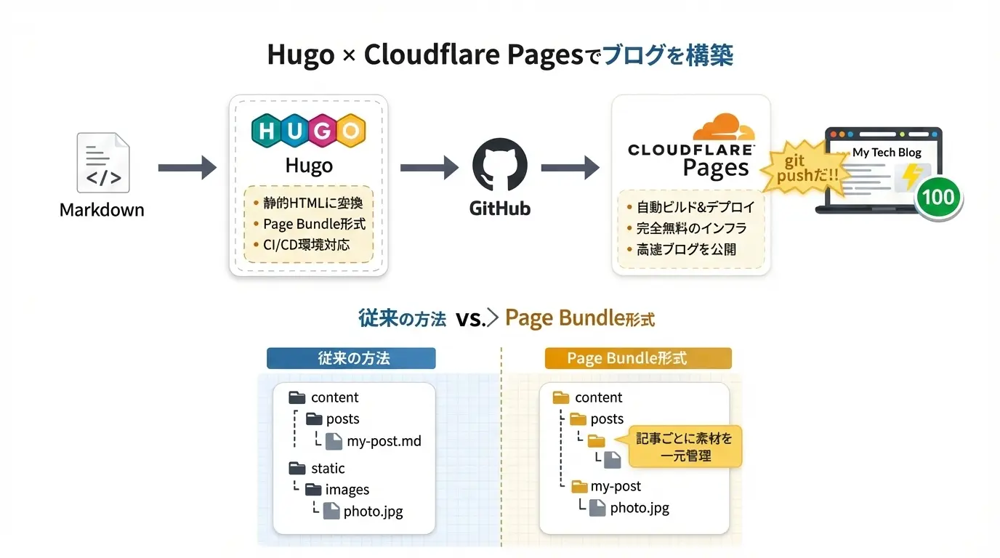


**Hugo × Cloudflare Pagesで技術ブログを構築したい人向けの記事です。**

私は以前、WordPressで技術ブログを運営していましたが、

- 表示速度が遅い  
- アップデートのたびに壊れる  
- サーバー代が地味にかかる  

といった問題にずっと悩まされていました。

そこで実際に移行したのが、**Hugo × Cloudflare Pages** という構成です。

結果として、

- 初回表示はほぼ一瞬  
- 月額コストは0円  
- デプロイは git push だけ  

という、個人開発者にとって理想的な環境を構築できました。

本記事は、**私自身がこの構成でブログを立ち上げた実体験をベースに**、最短で再現できる手順をまとめたものです。


<figure class="moov-structure">
  

  <figcaption>
    <strong>図：Hugo × Cloudflare Pages のビルド・デプロイ構成</strong>
  </figcaption>
</figure>

この記事では、HugoとCloudflare Pagesを使った技術ブログ構築の全体構成から、実際のデプロイ設定・運用時の注意点までを一貫して解説します。

## 1. なぜ「Hugo × Cloudflare Pages」なのか？
実際に検討した構成は、次の3つでした。

- WordPress + レンタルサーバー  
- Next.js + Vercel  
- Hugo + Cloudflare Pages  

最終的に Hugo × Cloudflare Pages を選んだ理由は、

- ビルド速度が圧倒的に速い  
- ランニングコストが0円  
- Markdown資産を長期保存できる  

という点でした。

特に「将来別のSSGに移行しても記事が腐らない」点は、  
技術ブログ運営では非常に重要だと感じています。

個人ブログを構築する手段は様々ですが、この組み合わせには圧倒的なメリットがあります。

- **執筆に集中**: Markdownを書くだけで、複雑なHTML/CSSの調整から解放されます。
- **SEO・パフォーマンス**: 生成されるのは純粋なHTML。最初からPageSpeed Insightsで100点を目指せる基盤があります。
- **Gitによるバージョン管理**: 全ての変更履歴がGitHubに残るため、過去の状態への復元も簡単。
- **完全無料のCI/CD**: `git push` するだけでCloudflareが自動でサイトをビルド・公開。サーバー管理の手間は一切不要です。

---

## 2. 記事作成のベストプラクティス：Page Bundles

Hugoにはいくつかの記事管理方法がありますが、**Page Bundles**形式を強く推奨します。

### 従来の方式 vs Page Bundles
- **従来**: `content/posts/my-post.md` と `static/images/photo.jpg`。画像と記事が離れていて管理しにくい。
- **Page Bundles**: `content/posts/my-post/index.md` と、同じディレクトリ内に画像を配置。**記事ごとに素材を一元管理**できます。

### 記事ディレクトリの作成
```bash
hugo new content posts/my-first-guide/index.ja.md
```

作成されたディレクトリ内に、アイキャッチ画像（`featured.webp` など）も一緒に保存しましょう。

---

## 3. Blowfishテーマを使いこなす

当ブログでも採用している **Blowfish** テーマは、Hugoの中でも特にデザイン性と機能性に優れています。

### ショートコードの活用
記事を読みやすくするために、積極的にショートコードを使いましょう。


**おすすめ活用法：**
- `lead`: 導入文を強調
- `alert`: 補足情報や注意喚起
- `button`: 外部リファレンスへの誘導


### 画像の最適化（Featured Image）
フロントマターで `showHero: true` を設定し、`featured.webp` という名前の画像をディレクトリ内に置くだけで、自動的に美しいヒーロー画像（アイキャッチ）が表示されます。

---

## 4. Cloudflare Pages へのデプロイ設定

GitHubへpushした後は、Cloudflare Pages 側で以下の設定を行うだけで公開が完了します。

### ビルド設定の詳細
| 項目 | 設定値 | 理由 |
| :--- | :--- | :--- |
| **Framework preset** | `Hugo` | 標準のプリセットを使用 |
| **Build command** | `hugo --minify` | ファイルを圧縮して高速化 |
| **Build directory** | `public` | 公開用フォルダを指定 |
| **Environment Variable** | `HUGO_VERSION = 0.140.0` | 確実に動作する最新版を指定 |

---

## 5. つまずきがちなポイントと解消法

| 現象 | 原因と解決策 |
| :--- | :--- |
| **画面が真っ白、またはスタイルが崩れる** | `hugo.toml` の `baseURL` が `https://xxx.pages.dev/` など、正しいURLになっているか確認してください。 |
| **画像が表示されない** | 大文字・小文字のミスはないか、Page Bundle の相対パスが正しいかを確認。 |
| **更新が反映されない** | Cloudflareのキャッシュではなく、ビルドログを見てエラーが出ていないかチェック。 |

---

## 6. まとめ：ブログは「資産」になる

Hugoでブログを作ることは、単に情報を発信するだけでなく、**自分だけの技術資産を構築するプロセス**でもあります。
Markdownで書き溜めた記事は将来、別のプラットフォームへ移行する際も汎用性が高く、エンジニアにとって最も「腐りにくい」ストック手法です。

まずは最初の一歩として、今回の手順でHello Worldを公開してみましょう。その一回が、あとの継続を圧倒的に楽にしてくれるはずです。

---

## よくある質問（FAQ）

### Hugo初心者でもこの構成は使えますか？

はい。GitHubと基本的なコマンド操作ができれば、1〜2時間程度で公開まで到達できます。

### Cloudflare Pagesは本当に無料で使えますか？

個人ブログ規模であれば、無料プランでほぼ制限なく利用できます。

### 途中で構成を変えることはできますか？

はい。記事はMarkdownで保存されているため、将来Next.jsや別のSSGに移行するのも容易です。


---

### 📘 関連資料
<div class="flex flex-col gap-2 items-start">

Blowfish 公式ドキュメント


Cloudflare Pages ドキュメント

</div>
