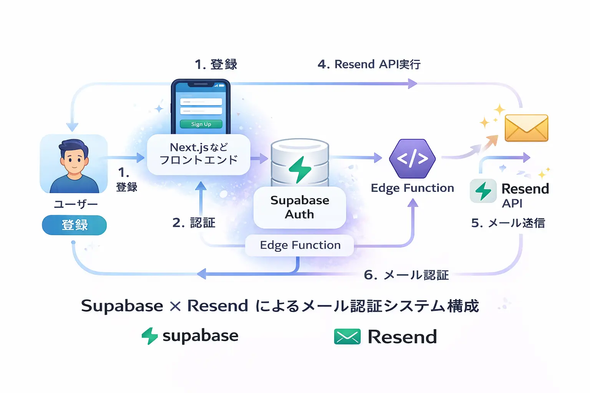


ユーザー登録機能を実装する際に必要になるのが **メール認証機能** です。

しかし、

- メール送信の実装が面倒
- 外部サービスはコストがかかる

といった理由で、導入に悩む方も多いのではないでしょうか。

そこでおすすめなのが、**Supabase × Resend** の構成です。

この組み合わせを使えば、

- 認証：Supabase Auth
- メール送信：Resend

を **無料で実装**できます。

この記事では、**Next.jsを使ってメール認証付き登録を実装する方法**を  
実装コード付きでわかりやすく解説します。

この記事は以下のような方におすすめです。

- 個人開発で無料で認証を実装したい
- Supabaseのメールに限界を感じている
- Next.jsで認証機能を作りたい


---

## Supabase × Resendでメール認証を実装する全体の流れ

<figure class="moov-structure">
  
  <figcaption>
    <strong>図：Supabase × Resend の認証フロー</strong>
  </figcaption>
</figure>

処理の流れは以下の通りです。

```

ユーザー登録
↓
Supabase Authでユーザー作成
↓
Edge FunctionsでResendを呼び出し
↓
メール送信
↓
ユーザーが認証リンクをクリック
↓
認証完了

```

---

## なぜSupabaseだけではダメなのか

Supabase単体でもメール認証は可能ですが、以下の制約があります。

### メールの自由度が低い
- HTMLカスタマイズが制限される

### 柔軟な送信ができない
- 任意タイミングで送信できない
- 独自フローが作りづらい

### メール管理が弱い
- 配信ログ
- 到達率
- エラー管理

👉 そこで **Resendを併用することで解決できます**

| 項目 | Supabaseのみ | Supabase × Resend |
|------|-------------|------------------|
| メール自由度 | △ | ◎ |
| 配信管理 | △ | ◎ |
| 実装の簡単さ | ◎ | ○ |

---

## Resendを使うメリット

- HTMLメールが自由に作れる
- APIで柔軟に送信できる
- 配信ログ確認が可能
- 高い到達率

👉 結論

**認証：Supabase / メール：Resend が最適構成**

---

## 無料で使える理由

### Supabase
- Auth無料
- 小規模なら無料枠で十分

### Resend
- 月間無料送信枠あり

👉 個人開発ならほぼ無料で運用可能

※ 目安
- Supabase：無料（Auth + DB）
- Resend：月100通程度なら無料枠内

---

## Supabaseのセットアップ

1. プロジェクト作成
2. APIキー取得

```ts
import { createClient } from "@supabase/supabase-js";

export const supabase = createClient(
  process.env.NEXT_PUBLIC_SUPABASE_URL!,
  process.env.NEXT_PUBLIC_SUPABASE_ANON_KEY!
);
````

---

## Supabaseのデフォルトメールを無効化する

Resendを使う場合は **Supabaseのメール送信を使わないようにする**必要があります。

ダッシュボードで以下を設定：

* Email confirmations OFF（またはテンプレート未使用）

※ 注意  
SupabaseのデフォルトメールをONのままにすると  
「Supabaseのメール」と「Resendのメール」が二重送信されます。

---

## Next.jsでユーザー登録を実装

```ts
export async function signUp(email: string, password: string) {
  const { data, error } = await supabase.auth.signUp({
    email,
    password,
  });

  if (error) throw error;

  return data;
}
```

---

## Edge FunctionsでResendを呼び出す

```ts
import { Resend } from "resend";

const resend = new Resend(process.env.RESEND_API_KEY);

export async function sendMail(email: string, token: string) {
  const url = `https://example.com/verify?token=${token}`;

  await resend.emails.send({
    from: "onboarding@example.com",
    to: email,
    subject: "メール認証",
    html: `<a href="${url}">認証する</a>`,
  });
}
```

### なぜEdge Functionsを使うのか

- APIキーをクライアントに公開しないため
- セキュアにメール送信するため

---

## 認証トークンを保存するDB設計

メール認証を実装するには、認証用トークンをデータベースに保存する必要があります。

以下のようなテーブルを作成します。

```sql
CREATE TABLE email_verifications (
  id uuid PRIMARY KEY DEFAULT gen_random_uuid(),
  email text NOT NULL,
  token text NOT NULL,
  expires_at timestamp NOT NULL,
  created_at timestamp DEFAULT now()
);
```

※ なぜDBに保存するのか  
→ トークンの正当性と有効期限を検証するためです。

カラムの役割

* email：認証対象のメールアドレス
* token：認証用トークン
* expires_at：有効期限
* created_at：作成日時

👉 トークンはセキュリティのため、必ず有効期限を設定しましょう。

---

## 認証リンク（トークン）の実装

```ts
// トークン生成（UUID）
const token = crypto.randomUUID();

await db.insert({
  email,
  token,
  expires_at: new Date(Date.now() + 1000 * 60 * 30), // 30分
});
```

---

## 認証APIの実装

```ts
export async function verify(token: string) {
  const record = await db.find(token);

  if (!record) throw new Error("無効なトークン");

  if (record.expires_at < new Date()) {
    throw new Error("期限切れ");
  }

  // 認証完了
  await db.updateUserVerified(record.email);

  // トークン削除
  await db.delete(token);
}
```

---

## ハマりポイント（初心者向け）

### メールが届かない

* ドメイン未認証
* APIキー間違い

---

### 認証リンクが動かない

* URLミス
* トークン未保存

---

### localhostで動かない

* URL設定ミス

---

## 注意点

### Tokenは必ず期限付きにする

→ セキュリティ対策

---

### Tokenの使い回し禁止

→ 1回使ったら削除

---

## FAQ

### Supabaseだけでできますか？

可能ですが、柔軟性が低いため
**Resend併用がおすすめです。**

---

### 無料でどこまで使えますか？

小規模サービスなら
👉 ほぼ無料で運用可能

## 本番運用時の注意点

- ドメイン認証（必須）
- SPF / DKIM設定
- メールのスパム対策
- 再送機能の実装

---

## まとめ

SupabaseとResendを組み合わせることで、

* 認証機能
* メール送信

を **無料かつ柔軟に実装**できます。

特に

* 個人開発
* MVP開発
* スタートアップ

に最適な構成です。

👉 ぜひ一度試してみてください。

---

## 📘 関連資料

<div class="flex flex-col gap-2 items-start">

Supabase公式

Resend公式

</div>
